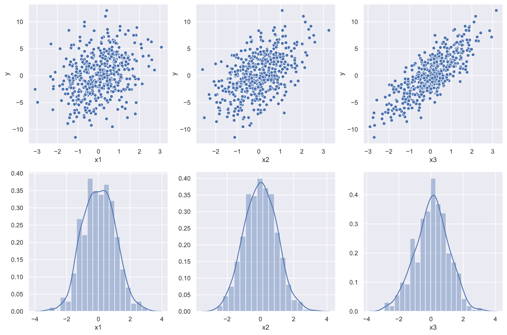

# README

Subplots - plot multiple graphs in a grid-like structure



## Usage

The GridSubplot class provides a simple interface for plotting subplots

Constructing the plot:

```python
from subplots.plot import GridSubplot
import seaborn as sns

gsp = GridSubplot(col_wrap=5)

# Plot multiple x columns against the y column
for xc in x_cols:
    gsp.add_plot(sns.scatterplot, x=df[xc], y=df[y_col])

# Or plot the distributions of multiple x columns
for xc in x_cols:
    gsp.add_plot(sns.distplot, None, None, df[xc])
```

Showing the plot:

```python
import matplotlib.pyplot as plt

sns.set()
plt.rcParams['figure.figsize'] = [15, 10]

# Show the plot
gsp.plot()
plt.show()
```
